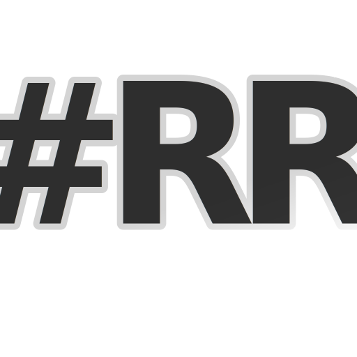

# #RR Browser

> **Really Rich. Really Private. Really Fast.**
> The browser that doesn't compromise.



---

## What is #RR?

**#RR Browser** is a Firefox fork built from the ground up for people who are done compromising their privacy. Inspired by LibreWolf, Arkenfox, and Betterfox — but harder, cleaner, and more opinionated.

No telemetry. No Pocket. No Mozilla accounts required. No ads. No filter bubbles. Just the web on your terms.

---

## Features

### 🛡️ Privacy — Maximum
- All telemetry, crash reports, and data collection **permanently disabled**
- Pocket, Firefox Relay, Mozilla VPN promos — **removed**
- Firefox Suggest (sponsored URL bar results) — **blocked**
- First Party Isolation enabled by default
- Canvas & WebGL fingerprint resistance
- WebRTC IP leak protection
- Cross-site cookie isolation (cookieBehavior=5)
- Strict Enhanced Tracking Protection (cryptomining, fingerprinting, social)
- Google Safe Browsing replaced by uBlock Origin + DNS filtering

### ⚡ Performance — Optimized
- Build with `-O3 -march=native` optimization
- WebRender (GPU renderer) force-enabled
- Hardware video decoding enabled
- HTTP/3 (QUIC) enabled
- Smooth scroll with MSD physics engine
- 8 content processes by default
- jemalloc memory allocator
- Stripped debug symbols and test code

### 🔍 Search — Private
- **DuckDuckGo** as default (no tracking, no filter bubble)
- Search suggestions disabled by default (no keystrokes sent)
- Bing, Google, Amazon removed from search engines
- No sponsored suggestions ever

### 🎨 UI — Clean
- Dark theme by default (#RR Dark)
- Pocket button, Firefox View, Sync button, Shopping button — all hidden
- No first-run onboarding
- No "What's new" interruptions
- Custom `userChrome.css` with silver/black aesthetic
- Customization Panel at `about:rr` (coming in v1.1)

### 🧩 Extensions (Pre-configured)
- **uBlock Origin** — force installed, can't be removed
- **Multi-Account Containers** — for cookie isolation per site
- Recommended: LocalCDN, ClearURLs, Bitwarden, CanvasBlocker

---

## Build Instructions

### Requirements
- Linux (Ubuntu 22.04+ recommended) or macOS 13+
- 8+ GB RAM (16 GB recommended)
- 30+ GB free disk space
- Rust, Python 3.10+, Node.js 18+, NASM

### Setup
```bash
# 1. Clone the repo
git clone https://github.com/jahaziel4444/-RR.git
cd -RR

# 2. Bootstrap dependencies
./mach bootstrap

# 3. Build
./mach build

# 4. Run
./mach run
```

The `.mozconfig` at the root handles all branding and optimization flags automatically.

### Apply Privacy Config
After building, copy the profile files:
```bash
# Find your profile directory
./mach run --profile /tmp/rr-test-profile

# Copy our config
cp browser/app/profile/rr-browser.js /tmp/rr-test-profile/user.js
cp -r chrome/RR /tmp/rr-test-profile/chrome
cp distribution/policies.json distribution/
```

---

## File Structure (RR-specific files)

```
.mozconfig                              ← Build flags (branding, optimization, strip bloat)
browser/
  branding/RR/
    configure.sh                        ← App name, ID, vendor
    logo.svg                            ← #RR logo (all sizes generated from this)
    locales/en-US/brand.dtd             ← UI strings (browser name everywhere)
    locales/en-US/brand.properties      ← Same but .properties format
  app/profile/
    rr-browser.js                       ← THE privacy + performance config (user.js)
  components/customizationpanel/
    rr-settings.html                    ← Full settings panel UI
chrome/RR/
  userChrome.css                        ← Browser UI customization
  userContent.css                       ← Internal pages styling
distribution/
  policies.json                         ← Enterprise policies (locks telemetry off, forces uBlock)
```

---

## Comparison

| Feature | Firefox | LibreWolf | #RR Browser |
|---|---|---|---|
| Telemetry | ✅ Enabled | ❌ Disabled | ❌ Disabled |
| Pocket | ✅ | ❌ | ❌ |
| Default Search | Google | DuckDuckGo | DuckDuckGo |
| uBlock Origin | ❌ | ✅ | ✅ Force-installed |
| FPI (First Party Isolation) | ❌ | ✅ | ✅ |
| GPU Optimization | Partial | Partial | ✅ Full |
| Custom UI Panel | ❌ | ❌ | ✅ |
| Build Optimization | Standard | Standard | -O3 native |
| Sponsored Suggestions | ✅ | ❌ | ❌ |

---

## License

Mozilla Public License 2.0 (same as Firefox). See `LICENSE`.

---

## Credits

Built by [@jahaziel4444](https://github.com/jahaziel4444)  
Privacy config inspired by: [Arkenfox](https://github.com/arkenfox/user.js), [Betterfox](https://github.com/yokoffing/Betterfox), [LibreWolf](https://librewolf.net)

> *"LibreWolf and Floorp are cool. #RR is different."*
